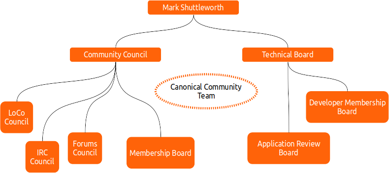

(project-governance)=
# Project governance

```{toctree}
:maxdepth: 1
:hidden:

canonical
debian
```

The {ref}`mission of Ubuntu <mission>` draws a very diverse community of participants and collaborators and contributors, who have wildly different interests and goals. We want to draw on the talents of a diverse global community, and to do that, we establish high standards for collaboration, debate, delegation of responsibility and ethics.

One of the key innovations that Ubuntu pioneered in free software communities is the use of a {ref}`Code of Conduct <code-of-conduct>`. It lays out the expectations that we have of those who participate, represent or engage with the project. Essentially, it calls on people to treat one another with respect regardless of their differences of opinion, and it is the foundation for all of our governance practices. The Ubuntu Code of Conduct continues to serve as a template for many other communities since it was established in 2004.

Our goals in setting up the governance structures of Ubuntu are to ensure that:

1. There is a defined process that helps people participate in decisions regarding the Ubuntu community and distribution. It should be clear who is responsible for any given decision, and how others might contribute to the outcome.

2. Decisions regarding the Ubuntu distribution and community are taken in an accountable, fair and transparent fashion.

3. Necessary decisions are actually taken, even when there is no clear consensus among the community. There is a single path for the appeal or escalation of a decision when needed.


## Governance Structure

Ubuntu has always been a very openly governed community. This open governance means that we have some community organized and run decision-making groups that help to lead and make decisions about different elements of Ubuntu.

In the early days of the project, there was only the Community Council and Technical Board, but as the Ubuntu community grew, additional sub-councils were formed to help lead their specific parts of the community.

The current governance map of Ubuntu looks like this:




## Ubuntu Community Council

The social structures and community processes of Ubuntu are supervised by the [Ubuntu Community Council](https://ubuntu.com/community/governance/community-council), which manages nominations and elections for Ubuntu boards and councils. The council is also responsible for the {ref}`Code of Conduct <code-of-conduct>` and tasked with ensuring that community members and leaders live up to the standard it sets.

The Council is ultimately responsible for dispute resolution, should it be required. For example, in the past, we have helped to resolve conflicts in LoCo teams and in the Ubuntu forums -- both very important parts of the community that have their own leadership structures carrying authority delegated by the Community Council.

The community council meets with the rest of the governance bodies every two months as part of the [Ubuntu Governance Sync Meetings](https://discourse.ubuntu.com/t/announcement-ubuntu-governance-sync-meetings-2025/48996).


## Ubuntu Technical Board

The [Ubuntu Technical Board](https://ubuntu.com/community/governance/technical-board) is responsible for the technical direction of Ubuntu. It makes decisions on package selection, packaging policy, installation systems and processes, kernel, X server, display management, library versions and dependencies. The board works with relevant teams to establish a consensus on the right path to take, especially where diverse elements of Ubuntu cannot find consensus on shared components.

The Ubuntu Technical Board meets every two weeks on IRC -- [date and agenda of the next meeting](https://wiki.ubuntu.com/TechnicalBoardAgenda), alternating with the Community Council. You can propose an item for discussion by putting it on the [Technical Board Agenda](https://wiki.ubuntu.com/TechnicalBoardAgenda) on the Ubuntu Wiki.


## SABDFL

This is not a democracy, it's a meritocracy. We try to operate more on consensus than on votes, seeking agreement from the people who will have to do the work. [Mark Shuttleworth](https://wiki.ubuntu.com/MarkShuttleworth), as self-appointed benevolent dictator for life (SABDFL), plays the happily undemocratic role of sponsor to the project. He has the ability, with regard to Canonical employees, to ask people to work on specific projects, specific feature goals and specific bugs.

He also has a casting vote on the Technical Board and Community Council, should it come to a vote. This capacity is not used lightly.

The community functions best when it can reach broad consensus about a way forward. However, it is not uncommon in the open-source world for there to be multiple good arguments, no clear consensus, and for open questions to divide communities rather than enrich them. The debate absorbs the energy that might otherwise have gone towards the creation of a solution. In many cases, there is no one 'right' answer, and what is needed is a decision more than a debate. The SABDFL acts to provide clear leadership on difficult issues, and set the pace for the project.


## Appointments

Mark, as project sponsor, is responsible for short-listing volunteers and community nominees as candidates for both the Community Council and Technical Board. In each case, a poll of relevant members of the project is conducted to select, or veto, the final membership of the Community Council and Technical Board.


## Delegation, councils, boards and teams

The Community Council and Technical Board, in turn, delegate their responsibilities through a large, dynamic and complex web of teams that span both the globe and a vast diversity of disciplines. In general, these groups try to conduct polls of relevant portions of the community to test the quality of their appointments, but they can also act unilaterally to ensure that the best people are recognised as leaders, decision makers and experts to get the job done.


## Ubuntu teams

There are a number of [key teams](https://discourse.ubuntu.com/t/ubuntu-teams/33113) that are responsible for different areas of Ubuntu -- documentation, kernel, servers, laptops and translation to name a few.

If you have a particular interest in a specific aspect of the project, please join that team's discussions and contribute to their decisions. Examples include teams focused on Ubuntu laptop usage, the Ubuntu desktop look and feel, Ubuntu for servers, release management and the installer. If you would like to set up a new team, please gather some like-minded people and propose ideas for consideration by the Ubuntu Community Council.


## Local Community Teams

A major part of the fabric of the community is the Local Community (LoCo) team structure. LoCo teams work with local Linux User Groups (LUGs), schools, municipalities and even national governments to open people's eyes to the world of free software.

Local Community teams are a great way to gather free software lovers together for beer, open discussion, talks, marketing events and to recognise the achievements of local free software contributors. LoCo teams are provided with spaces for discussion, collaboration and event planning on the [Ubuntu Discourse](https://discourse.ubuntu.com/c/locos/129).

To join a Local Community team or learn how to start one in your area, check out  [Ubuntu Local Communities](https://ubuntu.com/community/locos).

