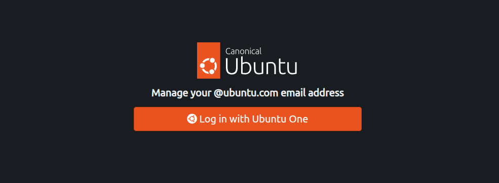
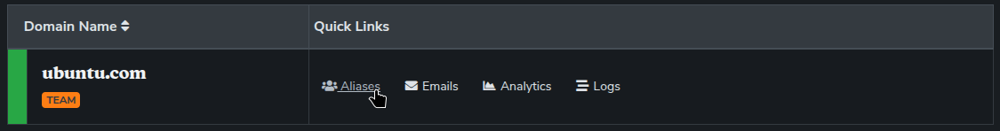
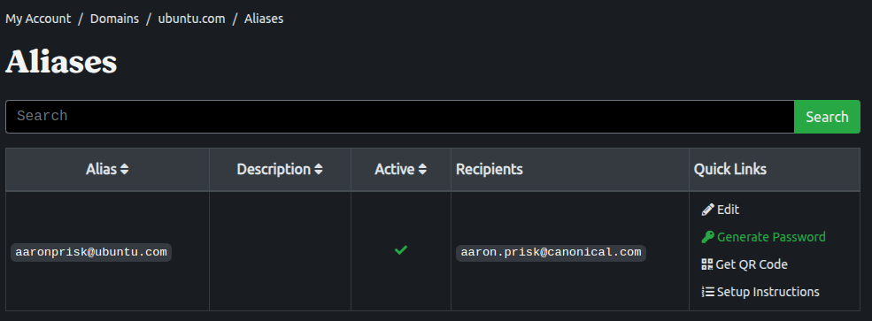
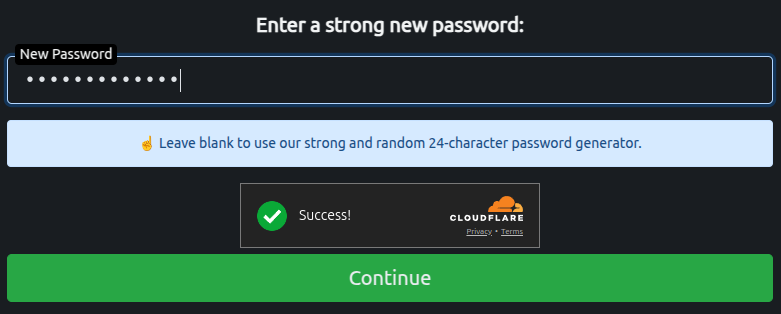
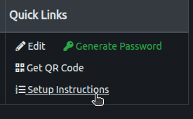

(ubuntu-email)=
# Ubuntu Member email alias

Ubuntu Members are granted special `@Ubuntu.com` aliases they can use to send and receive emails. Official members looking to enable this perk will need to set up a ForwardMail account by following these steps:

1. Log into [ForwardMail](https://forwardemail.net/en/ubuntu) using your UbuntuOne SSO account. Under {guilabel}`Quick Links` beside the [ubuntu.com](http://ubuntu.com/) domain, select **Aliases**.

1. Select {guilabel}`Edit` under {guilabel}`Quick links` and enter your personal email under **Forwarding Recipients**.

4. If you plan on sending emails via your [ubuntu.com](http://ubuntu.com/) address, then under {guilabel}`Quick Links` select {guilabel}`Generate Password` to create a unique password. You will use this when configuring your SMTP services on your mail application of choice.

5. Once you have your SMTP password, you can click on the {guilabel}`Setup Instructions` link to learn how to configure mail sending on various desktop and mobile mail applications.

## Feedback and support

If you experience any problems setting up your Ubuntu member email alias, please send an email to [community@canonical.com](mailto:community@canonical.com).
